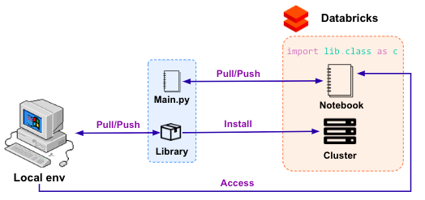

# Delta Lake Helpers
Repo contains a skeleton of the app for processing large volumes of data using [Apache (Py)Spark](https://spark.apache.org/docs/latest/api/python/). The app is platform agnostic, although some basic operations while running the code in [Databricks](https://databricks.com/) are included.

## Structure

### Dataset Config
Configuration files for dataset-specific values, located in `bin/dataset_config`.
* `dataset_config/dataset.ini` - powerful and simple way to store your config info for each dataset, enabling setting default values under `[DEFAULT]` section. More details on using `.ini` files in Python [here](https://docs.python.org/3/library/configparser.html).
* `dataset_config/schemas/mySchema.json` - examples schema file.

### Helpers
Processing logic is located in `bin/helpers` folder. It contains Python files used to read, process and write data.
* `auth.py` - helpers for spark authentication*. See how to configure authentication, for Azure Data Lake Storage Gen2: [here](https://docs.microsoft.com/en-us/azure/databricks/data/data-sources/azure/adls-gen2/azure-datalake-gen2-sp-access), for AWS S3: [here](https://docs.databricks.com/data/data-sources/aws/amazon-s3.html).
* `delta.py` - helpers for merging into [Delta tables](https://docs.delta.io/latest/quick-start.html).
* `logger.py` - helpers for logging into simple `.txt` files.
* `processing.py` - helpers for reading and data manipulation.
* `other.py` - other helpers.

* Bear in mind that [mounting](https://docs.databricks.com/data/databricks-file-system.html) storage enables all users of the workspace to access the mounted volume. If that's a security concern, consider adding auth credentials to `SparkSession`, through `spark.conf.set(config_key, config_val`).

## Running in Databricks
File `bin/main.py` can be considered an entry point for running the code in Databricks.
### Installing libraries
In order to use helpers in the repo, users can copy the code into the notebooks and execute it by importing specific functions. Another options is to use CI/CD pipeline that would create a library, that can next be [installed on our cluster](https://docs.databricks.com/libraries/index.html) (mind that re-boot of a cluster is needed to include new version of a library):

### Using env variables
In order to use env variables in Databricks, we can store them in files (i.e., `config/processing.py`), then import them into our notebook using `MAGIC %run ../config/processing` command - the code will be executed and all associated variables would be now accessible. 

Another option is to use [Job Parameters](https://docs.databricks.com/data-engineering/jobs/jobs.html#create-a-job) - then, if we add `"my_key": "my_val" `as a job parameter, it would be accessible in the notebook through `dbutils.widgets.get("my_key")`. 

Happy coding!